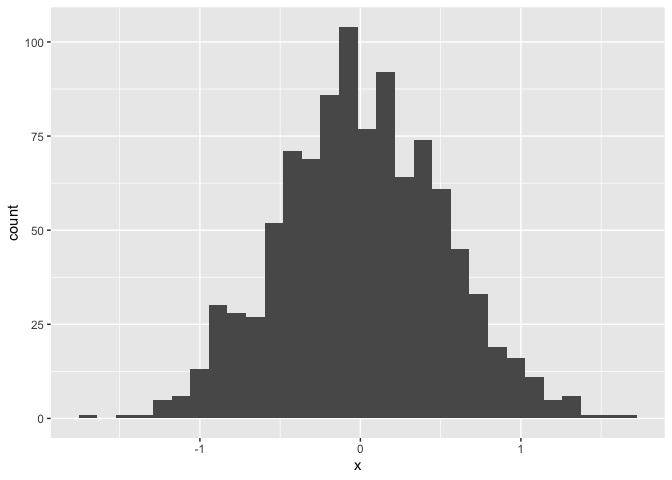
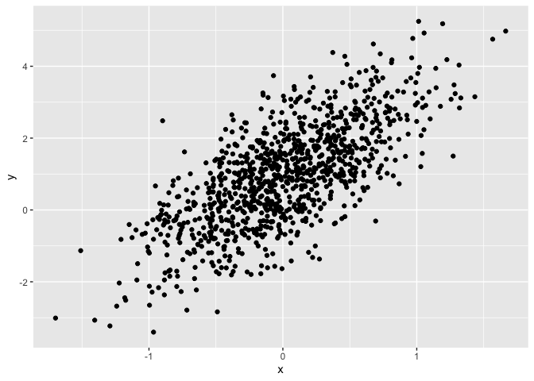

Simple document Git Testing
================
Hongtong Lin
2026-09-17

- [Section 0: libraries](#section-0-libraries)
- [Section 1](#section-1)
- [Section 2](#section-2)
- [Section 3: a tibble](#section-3-a-tibble)
- [Section 4: Plot](#section-4-plot)
- [Section 5: learning assignment 2](#section-5-learning-assignment-2)
- [Section 6: Text formatting](#section-6-text-formatting)
  - [Text formatting](#text-formatting)
  - [Headings](#headings)
- [1st Level Header](#1st-level-header)
  - [2nd Level Header](#2nd-level-header)
    - [3rd Level Header](#3rd-level-header)
  - [Lists](#lists)
  - [Tables](#tables)
- [Section 7: Learning assignment 3](#section-7-learning-assignment-3)

I’m an R Markdown document!

# Section 0: libraries

##### ‘load libraries’ is the name of this r chunk. naming each code chunks will help you check where the bugs are.

##### ‘message=F’ in the R chunk intro means that all of the messy info will be hidden.

##### ‘eval=F’ prevents the code inside a specific chunk from being executed when you knit the document.

``` r
library(tidyverse)
```

    ## ── Attaching core tidyverse packages ──────────────────────── tidyverse 2.0.0 ──
    ## ✔ dplyr     1.2.1     ✔ readr     2.2.0
    ## ✔ forcats   1.0.1     ✔ stringr   1.6.0
    ## ✔ ggplot2   4.0.3     ✔ tibble    3.3.1
    ## ✔ lubridate 1.9.5     ✔ tidyr     1.3.2
    ## ✔ purrr     1.2.2     
    ## ── Conflicts ────────────────────────────────────────── tidyverse_conflicts() ──
    ## ✖ dplyr::filter() masks stats::filter()
    ## ✖ dplyr::lag()    masks stats::lag()
    ## ℹ Use the conflicted package (<http://conflicted.r-lib.org/>) to force all conflicts to become errors

``` r
library(ggplot2)
```

# Section 1

Here’s a **code chunk** that samples from a *normal distribution*:

``` r
samp = rnorm(100)
length(samp)
```

    ## [1] 100

# Section 2

I can take the mean of the sample, too! The mean is 0.1072721.

# Section 3: a tibble

``` r
plot_df = tibble(
  x = rnorm(1000, sd = .5),
  y = 1 + 2 * x + rnorm(1000)
)
head(plot_df)
```

    ## # A tibble: 6 × 2
    ##         x      y
    ##     <dbl>  <dbl>
    ## 1  0.730   2.20 
    ## 2 -0.124   0.134
    ## 3 -0.184  -1.00 
    ## 4 -0.247   1.26 
    ## 5 -0.0699  3.74 
    ## 6 -0.720   0.557

# Section 4: Plot

##### ‘echo=F’ in the r chunk intro means the results will show up in the kinnted document

    ## `stat_bin()` using `bins = 30`. Pick better value `binwidth`.

<!-- --><!-- -->

# Section 5: learning assignment 2

Write a named code chunk that creates a dataframe comprised of: a
numeric variable containing a random sample of size 500 from a normal
variable with mean 1; a logical vector indicating whether each sampled
value is greater than zero; and a numeric vector containing the absolute
value of each element. Then, produce a histogram of the absolute value
variable just created. Add an inline summary giving the median value
rounded to two decimal places. What happens if you set eval = FALSE to
the code chunk? What about echo = FALSE?

This plot shows the distribution of the absolute value of
$X \sim N(1,1)$. **(this is the latex language)**

``` r
set.seed(1)
# Fixes the random number generator's starting point. Without it, rnorm() draws
# a different 500 numbers every time you knit, so your histogram and any numbers

la_df <- tibble(
  x = rnorm(500, mean = 1), # rnorm() = draw from a normal distribution. Smaple size of 500, mean =1, sd=1 by defult
  pos = x>0,
  abs_x = abs(x)
)

ggplot(
  la_df,
  aes(x = abs_x)
) + geom_histogram()
```

    ## `stat_bin()` using `bins = 30`. Pick better value `binwidth`.

<!-- -->

The median is 0.96. The code is
`round(median(la_df$x),2) or round(median(pull((la_df, x)),2)`

# Section 6: Text formatting

## Text formatting

*italic* or *italic* **bold** or **bold** `code` superscript<sup>2</sup>
and subscript<sub>2</sub>

## Headings

# 1st Level Header

## 2nd Level Header

### 3rd Level Header

## Lists

- Bulleted list item 1

- Item 2

  - Item 2a

  - Item 2b

1.  Numbered list item 1

2.  Item 2. The numbers are incremented automatically in the output.

## Tables

| First Header | Second Header |
|--------------|---------------|
| Content Cell | Content Cell  |
| Content Cell | Content Cell  |

# Section 7: Learning assignment 3

After the previous code chunk, write a bullet list given the mean,
median, and standard deviation of the original random sample.

- the medain is 0.96.\
- the mean is 1.02.\
- the standard deviation is 1.01.
